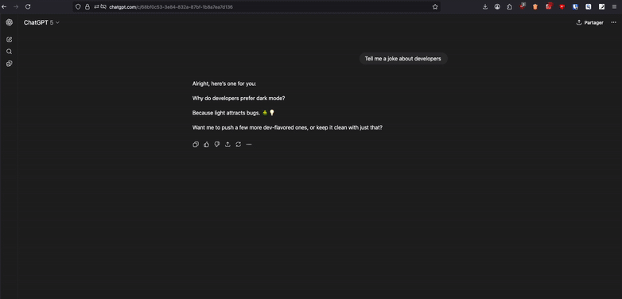

<p align="center">
  
</p>

# 📌 Clippin – ChatGPT Pin Manager


---

## ✨ Overview

**Clippin** is a browser extension that lets you **pin ChatGPT prompts and responses** into organized folders.  
No more endless scrolling through conversations — keep what matters, structured and easy to find.

- 📌 **Quick capture**: save prompts or answers in one click
- 🗂️ **Organized**: create, rename, and delete folders
- 🔄 **Persistent**: pins stay after closing the browser
- 🌐 **Synced via backend**: stored in a Postgres DB (Neon), accessed through a Next.js API

---

## 🚀 Stack

- **Backend**: Next.js + Prisma, deployed on **Vercel**
- **Database**: Neon (Postgres)
- **Frontend / Extension**: React + Vite + WebExtension API
- **Build & Deploy**: Vercel + GitHub

---

## 📦 Installation (local)

### Backend

```bash
cd backend
npm install
npm run dev
```

### Extension

```bash
cd extension
npm install
npm run build
```

Then load dist/ into Firefox:
→ about:debugging → This Firefox → Load Temporary Add-on → select manifest.json.

---

## 🎥 Demo

Here is how the v1 extension looks (Firefox temporary install) :



---

## ✅ Features (MVP v1)

- Create, rename, and delete folders
- Add and remove pins (ChatGPT prompts/responses - you have to copy and paste the text)
- Local client ID persistence (no auth)
- Live API deployed: clippin-api.vercel.app/api/health

---

## 📌 Roadmap (v2+)

- Add a “Pin” button directly inside ChatGPT’s UI (via content script)
- Chrome compatibility & Web Store releases
- UI/UX polish (search, tags, multi-select)

---

## 📂 Project Structure

```
clippin/
│
├── backend/             # Next.js API (folders, pins, health)
│   ├── prisma/          # Prisma schema & migrations
│   └── src/app/api/     # API routes
│
├── extension/           # Browser extension (React + Vite)
│   ├── public/          # Manifest & icons
│   └── src/             # React components, API calls
│
└── README.md            # Project documentation
```

---

## 🛡 License

This project is licensed under the MIT License – see the LICENSE file for details.

---

## 👩‍💻 Author

Ludivine Lombardi
GitHub: @lulmbd

---

## 📦 Assets & Licenses

This project uses some icons from [Twitter Twemoji](https://github.com/twitter/twemoji):

- Graphics Title: 270f.svg (and others for pin, folder, trash, etc.)
- Graphics Author: Copyright 2020 Twitter, Inc and other contributors
- Graphics Source: https://github.com/twitter/twemoji/blob/master/assets/svg
- Graphics License: [CC-BY 4.0](https://creativecommons.org/licenses/by/4.0/)

Other assets (logo, Clippin icon) are custom-made by the author.
